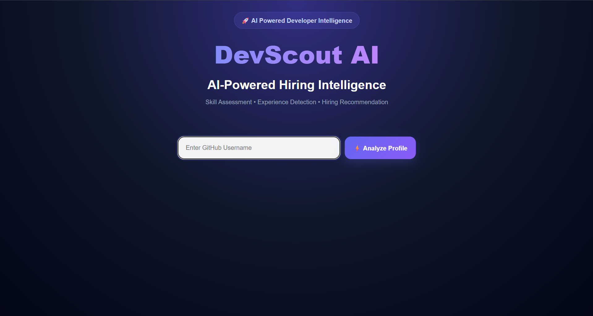
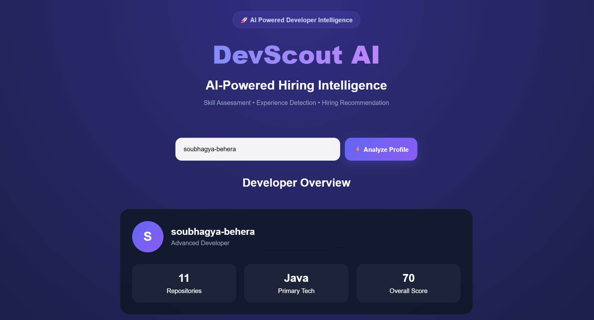
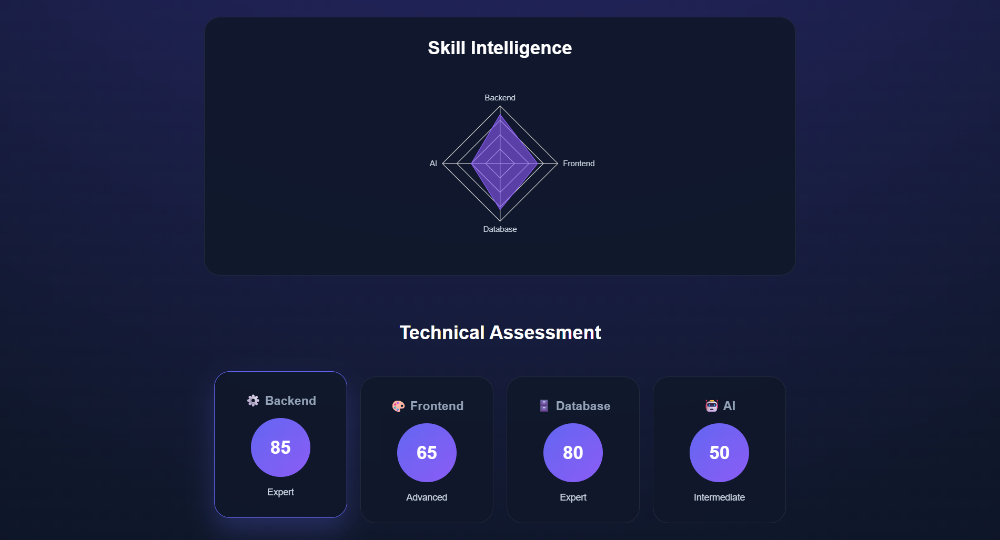
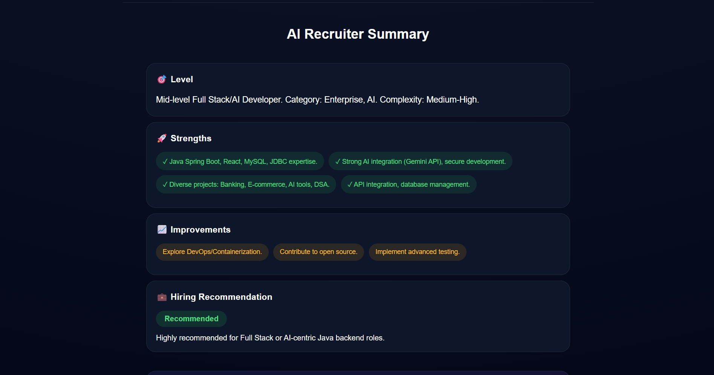
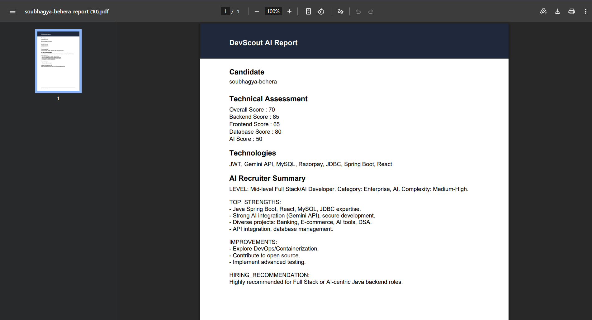

# 🚀 DevScout AI - GitHub Developer Intelligence Platform

DevScout AI is an AI-powered GitHub profile analysis platform that evaluates developers like a senior technical recruiter. The application analyzes repositories, technologies, coding patterns, and project complexity to generate recruiter-ready insights, technical assessments, skill scores, and hiring recommendations.

## ✨ Features

### 🔍 GitHub Profile Analysis

* Analyze any public GitHub profile
* Fetch repositories, contributions, and developer activity
* Generate comprehensive developer insights

### 🤖 AI-Powered Recruiter Evaluation

* Technical assessment using Gemini AI
* Candidate experience level detection
* Strengths and growth area identification
* Recruiter-style hiring recommendations

### 📊 Skill Intelligence Dashboard

* Backend Skill Analysis
* Frontend Skill Analysis
* Database Expertise Evaluation
* AI & Machine Learning Capability Assessment
* Interactive Radar Chart Visualization

### 🏆 Developer Scoring System

* Overall Developer Score
* Backend Score
* Frontend Score
* Database Score
* AI Score

### 🛠 Technology Detection

Automatically detects technologies from repositories including:

* Java
* Spring Boot
* React
* MySQL
* JWT
* Gemini API
* Razorpay
* JDBC
* And many more

### 📄 Professional PDF Reports

Generate recruiter-ready PDF reports containing:

* Candidate Summary
* Technical Assessment
* Technology Stack Analysis
* Skill Scores
* Hiring Recommendations

---

## 🏗 Tech Stack

### Frontend

* React.js
* JavaScript (ES6+)
* CSS3
* Recharts
* Axios

### Backend

* Java
* Spring Boot
* Spring Web
* GitHub REST API
* Gemini AI API

### Tools & APIs

* GitHub API
* Google Gemini API
* jsPDF

---

## 📸 Screenshots

### Home Page



### Candidate Dashboard



### Skill Intelligence Radar



### Recruiter Summary



### PDF Export



---

## 🚀 Getting Started

### Prerequisites

* Java 17+
* Node.js 18+
* Maven
* GitHub API Access
* Gemini API Key

### Backend Setup

```bash
git clone https://github.com/yourusername/devscout-ai.git

cd backend

mvn clean install

mvn spring-boot:run
```

### Frontend Setup

```bash
cd frontend

npm install

npm run dev
```

Frontend:

```bash
http://localhost:5173
```

Backend:

```bash
http://localhost:8080
```

---

## 📈 Workflow

1. Enter a GitHub username
2. Fetch repositories and profile information
3. Analyze technology stack
4. Generate AI-powered recruiter insights
5. Calculate skill scores
6. Produce hiring recommendation
7. Export professional PDF report

---

## 🎯 Use Cases

### For Recruiters

* Quick candidate evaluation
* Technical skill assessment
* Hiring recommendation support

### For Developers

* Portfolio evaluation
* Skill gap identification
* Resume and profile improvement

### For Hiring Managers

* Technical screening
* Candidate comparison
* Faster recruitment decisions

---

## 🔮 Future Enhancements

* GitHub Contribution Analysis
* Repository Quality Scoring
* ATS Compatibility Check
* Coding Pattern Detection
* Cloud Deployment Insights
* Team Fit Recommendations
* Multi-Candidate Comparison

---

## 👨‍💻 Author

**Soubhagya Kumar Behera**

Java Full Stack Developer | Spring Boot | React | AI Integration

* GitHub: https://github.com/soubhagya-behera

* LinkedIN: https://www.linkedin.com/in/soubhagyakumar-java

* Portfolio: https://soubhagya-portfolio-olive.vercel.app

---

⭐ If you found this project useful, consider giving it a star.
