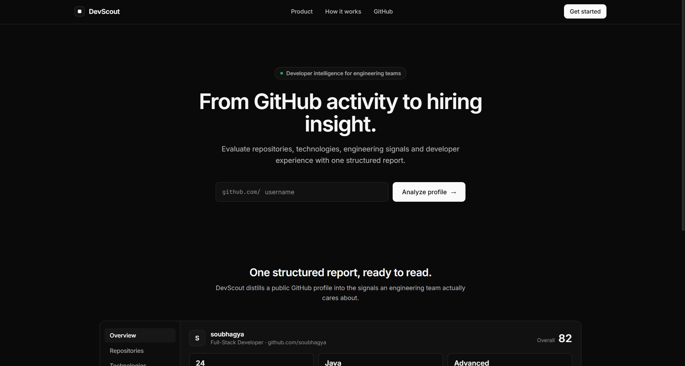
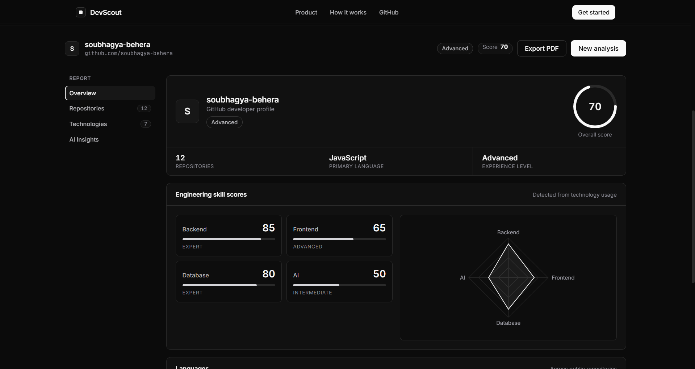
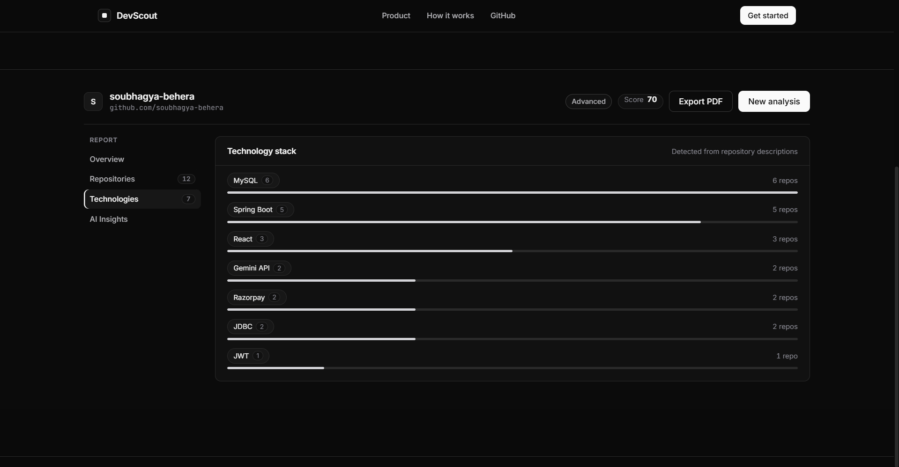
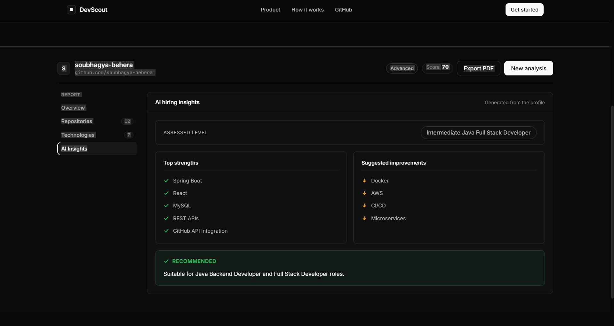
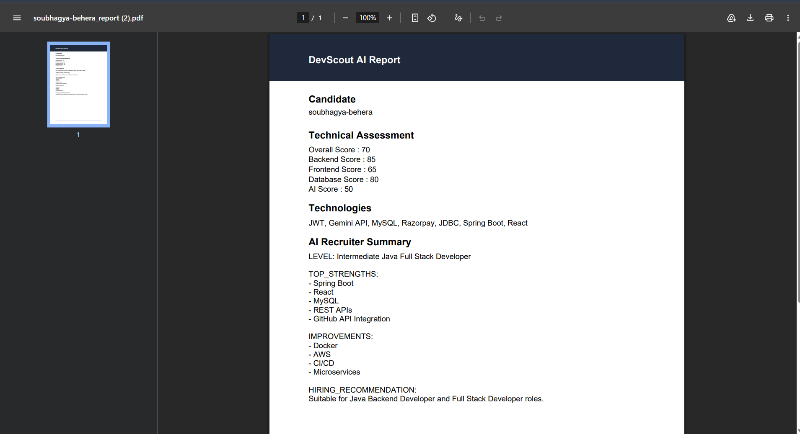

# 🚀 DevScout AI

### AI-Powered Developer Intelligence Platform

DevScout AI is a developer intelligence platform that transforms public GitHub repository data into structured technical insights, developer skill scores, and recruiter-ready candidate assessments.

Instead of manually reviewing multiple repositories, recruiters can enter a GitHub username and receive a consolidated developer report containing technical skills, technology detection, engineering scores, AI-generated insights, and hiring recommendations.

DevScout AI combines **GitHub REST API**, **Spring Boot**, and **Google Gemini AI** to create a streamlined developer evaluation workflow.

---

## 🌐 Live Demo

🚀 **Live Application:** https://dev-scout-ai.vercel.app

⚙️ **Backend API:** https://devscout-ai-backend.onrender.com/api/github

💻 **Source Code:** https://github.com/soubhagya-behera/DevScout-AI

---

## 🎯 Why DevScout AI?

Reviewing a developer's GitHub profile manually can require checking multiple repositories, technologies, project descriptions, and technical signals.

DevScout AI simplifies this process:

```text
GitHub Profile
      ↓
Repository Data
      ↓
Technology Detection
      ↓
Developer Skill Scoring
      ↓
AI-Powered Assessment
      ↓
Recruiter Insights
      ↓
Professional PDF Report
```
---

## ✨ Key Features

- 🔍 **GitHub Profile Analysis** — Analyze public GitHub profiles and repository data.

- 🤖 **AI Recruiter Evaluation** — Gemini-powered experience, strengths, improvements, and hiring insights.

- 📊 **Developer Skill Scoring** — Backend, Frontend, Database, AI, and overall scores.

- 🛠️ **Technology Detection** — Identify technologies and frameworks from repository metadata.

- 📈 **Skill Intelligence Dashboard** — Visualize technical strengths with interactive charts.

- 📄 **PDF Reports** — Generate professional recruiter-ready developer reports.

- ⚡ **API Optimization** — Minimized GitHub/Gemini requests with local analysis, caching, retries, and timeouts.

- 📱 **Responsive SaaS UI** — Modern developer-focused interface optimized for desktop and mobile.

---

## 🏗 Tech Stack

### Frontend
- React.js
- JavaScript (ES6+)
- CSS3
- Recharts
- Axios

### Backend
- Java 17
- Spring Boot
- Spring Web
- Maven

### APIs & Services

- GitHub REST API
- Google Gemini API
- jsPDF

### Deployment & Tools

- Docker
- Git
- GitHub
- Maven
- Vercel
- Render

---

## 🔄 Architecture

```text
React Frontend
      ↓
Spring Boot REST API
      ↓
GitHub REST API
      ↓
Local Developer Analysis
      ↓
Gemini AI
      ↓
Final Developer Report
      ↓
PDF Export
```
---

## 🔄 How It Works

1. Enter a public GitHub username.
2. DevScout fetches the developer's repository data.
3. Repository metadata is analyzed locally to detect languages and technologies.
4. Developer skill scores are calculated across Backend, Frontend, Database, and AI.
5. The aggregated profile is sent to Gemini for recruiter-style evaluation.
6. DevScout generates structured hiring insights and a professional PDF report.

### ⚡ Optimized API Usage

DevScout is designed to minimize unnecessary API requests:

- GitHub data is fetched once per uncached analysis.
- A single Gemini request generates the complete AI assessment.
- Local calculations handle technology detection and scoring.
- Cached results avoid repeated GitHub and Gemini requests.
- Retry and timeout handling improves API reliability.

---

## 📸 Screenshots

### Home Page


### Developer Dashboard


### Skill Intelligence


### AI Recruiter Insights


### PDF Report


---

## 🚀 Getting Started

### Prerequisites

- Java 17+
- Node.js 18+
- Maven
- GitHub API Token
- Gemini API Key

### Clone the Repository

```bash
git clone https://github.com/soubhagya-behera/DevScout-AI.git
cd DevScout-AI
```
---

## 🎯 Use Cases

### Recruiters
- Quickly evaluate public GitHub profiles.
- Identify technical strengths and technologies.
- Generate structured candidate insights.

### Developers
- Understand their technical profile.
- Identify strengths and improvement areas.
- Generate a professional developer report.

### Hiring Managers
- Perform an initial technical screening.
- Get a structured overview before deeper evaluation.

---

## 🔮 Future Enhancements

- GitHub contribution and activity analysis
- Repository quality scoring
- Commit and pull request analysis
- Multi-candidate comparison
- ATS compatibility analysis
- Advanced code-level analysis

---

## 👨‍💻 Author

**Soubhagya Kumar Behera**

Java Full Stack Developer | Spring Boot | React | AI Integration

- GitHub: https://github.com/soubhagya-behera
- LinkedIn: https://www.linkedin.com/in/soubhagyakumar-java
- Portfolio: https://soubhagya-portfolio-olive.vercel.app

---

⭐ If you found DevScout AI useful, consider giving the project a star.