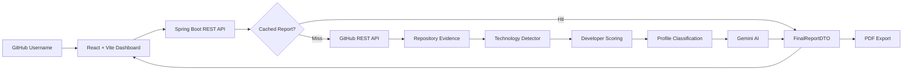
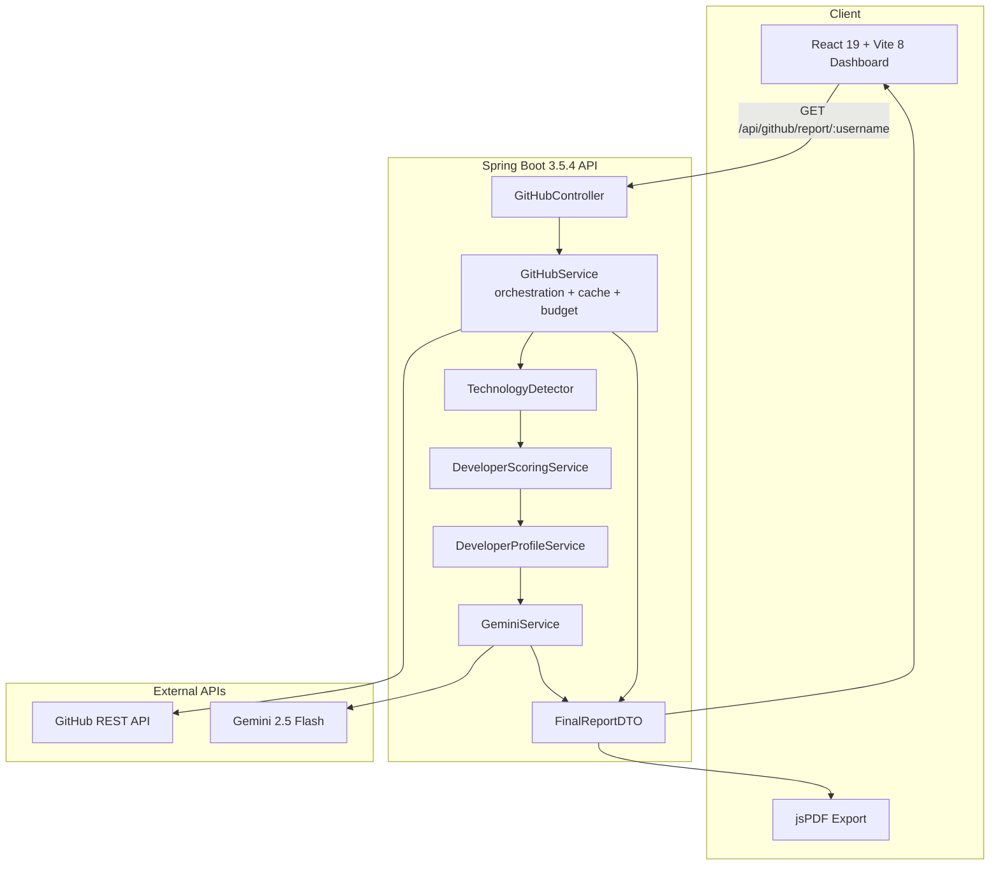
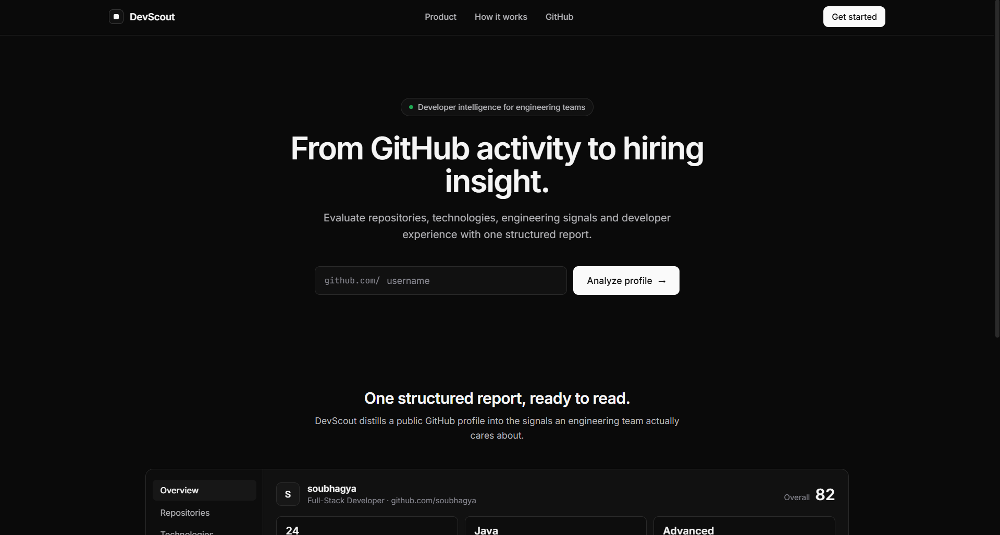
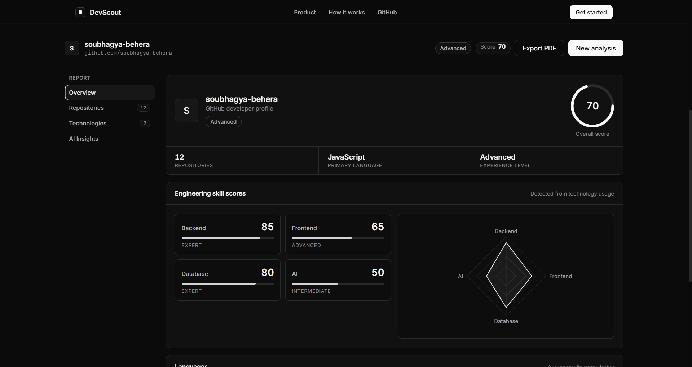
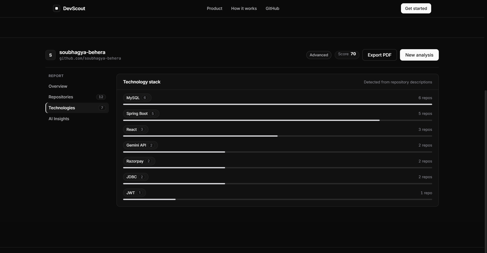
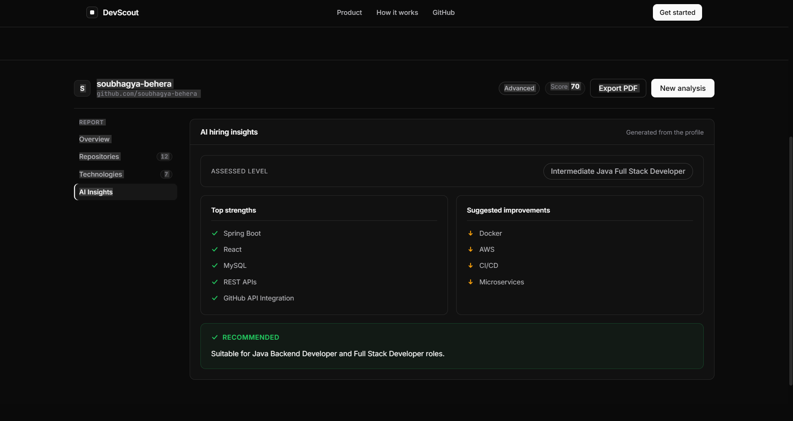
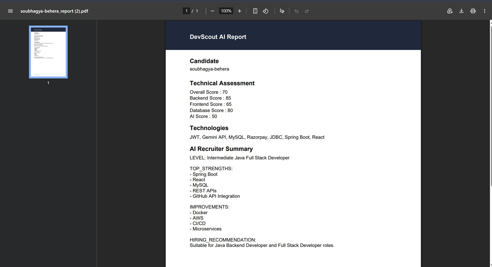

<div align="center">

# 🤖 DevScout AI

### GitHub Developer Intelligence Platform

<p>
Transform public GitHub repository evidence into structured technology intelligence,<br>
deterministic skill scoring, developer profiling, and AI-assisted recruiter insights — in one request.
</p>

<p>
<a href="https://dev-scout-ai.vercel.app"></a>
<a href="https://devscout-ai-backend.onrender.com/api/github/report/octocat"></a>
<a href="https://github.com/soubhagya-behera/DevScout-AI"></a>
</p>

<p>


</p>

<p>


</p>

<p>


</p>

<p>
<a href="#features">Features</a> •
<a href="#architecture">Architecture</a> •
<a href="#api-reference">API Reference</a> •
<a href="#getting-started">Getting Started</a> •
<a href="#screenshots">Screenshots</a> •
<a href="https://dev-scout-ai.vercel.app">Live Demo</a>
</p>

</div>

## 🎯 What is DevScout AI?

Recruiters and developers routinely judge GitHub profiles by skimming repositories, stars, and README files by hand. That process is slow, inconsistent, and misses the evidence hidden in topics, dependency manifests, and repository quality signals.

**DevScout AI** solves this with a single unified endpoint — `GET /api/github/report/{username}` — that fetches public repository data, analyzes it locally with deterministic rules, classifies the developer profile, and adds one focused Gemini call for qualitative recruiter context. The frontend makes one request and renders a complete dashboard with PDF export.

| Problem | DevScout Approach |
| ------- | ----------------- |
| Manual repository inspection | One unified report per username |
| Scattered technology evidence | Evidence-based detection across name, description, language, topics, README, manifests |
| Subjective technical signals | Deterministic 0–100 capability scoring with strength weighting |
| Long qualitative review | Single Gemini call for level, strengths, improvements, hiring note — with a deterministic fallback |

> [!NOTE]
> DevScout AI uses no database, no Redis, and no message queue by design. The backend is a stateless Spring Boot service with an instance-local bounded cache, deployable directly on Render.

## ✨ Features

<table>
<tr>
<td width="50%" valign="top">

### 🔍 GitHub Profile Analysis

Fetches up to 100 public repositories per user and enriches the strongest candidates with README and manifest evidence.

</td>
<td width="50%" valign="top">

### 🧠 Evidence-Based Technology Detection

Word-boundary-safe detection from name, description, language, topics, README (2 KB), and manifests (1 KB) with canonical names.

</td>
</tr>
<tr>
<td width="50%" valign="top">

### 📊 Deterministic Skill Scoring

Backend / frontend / database / AI / overall scores (0–100) from weighted repository evidence — no LLM randomness.

</td>
<td width="50%" valign="top">

### 🧩 Developer Profile Classification

Evidence-based profile type, confidence (LOW / MEDIUM / HIGH), specialization, and repository-depth experience level.

</td>
</tr>
<tr>
<td width="50%" valign="top">

### ⭐ Featured Repository Ranking

Up to 10 featured repositories ranked by quality score, stars, recency, and tech relevance — not stars alone.

</td>
<td width="50%" valign="top">

### 🤖 Gemini Qualitative Insights

One `gemini-2.5-flash` call per report for level, strengths, improvements, and a hiring recommendation, with a stack-neutral fallback.

</td>
</tr>
<tr>
<td width="50%" valign="top">

### ⚡ Cache + Single-Flight Optimization

30-minute bounded in-memory cache (max 500 entries) with per-username `CompletableFuture` deduplication for concurrent requests.

</td>
<td width="50%" valign="top">

### 📄 Professional PDF Export

One-click jsPDF export with header, candidate summary, scores, technologies, and AI summary — paginated, no internal fields.

</td>
</tr>
</table>

<details>
<summary>🛡️ Plus: structured errors &amp; responsive dashboard</summary>

- **Structured errors** — `USER_NOT_FOUND` (404), `RATE_LIMITED` (429), `GITHUB_AUTH_FAILED` (503), `GITHUB_UNAVAILABLE` (503), `BAD_REQUEST` (400), `INTERNAL_ERROR` (500, generic message).
- **Responsive dark SaaS dashboard** — Overview / Repositories / Technologies / AI Insights tabs with radar and progress visuals, verified at 320–1440px.

</details>

## 🔄 How It Works


```mermaid
flowchart LR
    U[GitHub Username]
    FE[React + Vite Dashboard]
    API[Spring Boot REST API]
    CACHE{Cached Report?}
    GH[GitHub REST API]
    EVIDENCE[Repository Evidence]
    TECH[Technology Detector]
    SCORE[Developer Scoring]
    PROFILE[Profile Classification]
    GEMINI[Gemini AI]
    REPORT[FinalReportDTO]
    PDF[PDF Export]

    U --> FE
    FE --> API
    API --> CACHE

    CACHE -->|Hit| REPORT
    CACHE -->|Miss| GH

    GH --> EVIDENCE
    EVIDENCE --> TECH
    TECH --> SCORE
    SCORE --> PROFILE
    PROFILE --> GEMINI
    GEMINI --> REPORT

    REPORT --> FE
    REPORT --> PDF
```

1. The dashboard sends **one request** to `GET /api/github/report/{username}`.
2. The backend checks the **bounded cache**; on a miss it fetches repository data from the **GitHub REST API** within a fixed request budget.
3. **TechnologyDetector → DeveloperScoringService → DeveloperProfileService** run locally and deterministically over repository evidence.
4. **GeminiService** adds one qualitative assessment (with retry and a deterministic fallback).
5. A single **`FinalReportDTO`** is cached, returned to the dashboard, and available for **PDF export**.

## 🏗️ Architecture

DevScout AI keeps all analysis server-side and deterministic, so the frontend never orchestrates multiple calls. AI is deliberately the last step: it interprets evidence the backend already scored, rather than replacing the scoring.


```mermaid
flowchart TB
    subgraph Client["Client"]
        UI[React 19 + Vite 8 Dashboard]
        PDF[jsPDF Export]
    end

    subgraph Server["Spring Boot 3.5.4 API"]
        CTRL[GitHubController]
        SVC[GitHubService<br/>orchestration + cache + budget]
        DET[TechnologyDetector]
        SCOR[DeveloperScoringService]
        PROF[DeveloperProfileService]
        GEM[GeminiService]
        DTO[FinalReportDTO]
    end

    subgraph External["External APIs"]
        GITHUB[GitHub REST API]
        GEMINIAPI[Gemini 2.5 Flash]
    end

    UI -->|GET /api/github/report/:username| CTRL
    CTRL --> SVC
    SVC --> GITHUB
    SVC --> DET
    DET --> SCOR
    SCOR --> PROF
    PROF --> GEM
    GEM --> GEMINIAPI
    GEM --> DTO
    SVC --> DTO
    DTO --> UI
    DTO --> PDF
```

| Component | Responsibility |
| --------- | -------------- |
| React / Vite dashboard | Search, tabbed report UI, charts, PDF export |
| `GitHubService` | Repository retrieval, orchestration, cache, single-flight, request budget |
| `TechnologyDetector` | Evidence-based technology detection with strength weighting |
| `DeveloperScoringService` | Deterministic backend / frontend / database / AI / overall scoring |
| `DeveloperProfileService` | Evidence-based profile classification and experience-depth level |
| `GeminiService` | Single qualitative AI assessment with retry and stack-neutral fallback |
| Bounded cache | TTL + bounded LRU behavior over `ConcurrentHashMap` |
| Single-flight map | Deduplicates concurrent same-user analysis via `CompletableFuture` |
| `FinalReportDTO` | Unified frontend response model |

## 🧠 Engineering Highlights

| Area | What is implemented |
| ---- | ------------------- |
| ⚡ Bounded cache | In-memory `ConcurrentHashMap`, 30-min TTL, max 500 entries (~2–5 MB), expired-first eviction, LRU-style `lastAccess` touch, no background thread |
| 🔄 Single-flight | Per-username `CompletableFuture` in an `inflight` map; concurrent same-user requests share one generation; failed generations are removed so the next request retries |
| 🧮 Deterministic scoring | Repository-evidence scoring with capability weighting, repository quality, and specialization-aware overall blend |
| 🧠 Evidence strength | `STRONG` (topics / manifest / README) · `MEDIUM` (name / description) · `WEAK` (language only) |
| 🌐 GitHub request budget | 1 repo-list request + max 20 deep HTTP attempts (README + contents + manifest) per report; every attempt counts, even on failure |
| 🛡️ Error mapping | `USER_NOT_FOUND` 404 · `RATE_LIMITED` 429 · `GITHUB_AUTH_FAILED` 503 · `GITHUB_UNAVAILABLE` 503 · `BAD_REQUEST` 400 · `INTERNAL_ERROR` 500 |

<details>
<summary>🧠 How technology detection works</summary>

Sources, in priority order: **topics and dependency manifests** (strong), **repository name and description** (medium), and **primary language** (weak). Matching is word-boundary safe and deduplicated per repository, then aggregated with canonical display names (for example, aliases resolve to `Spring Boot` or `React`). A per-repo cap prevents one repository from dominating the signal.

</details>

<details>
<summary>🧮 Scoring formula</summary>

Each capability (backend / frontend / database / AI) starts from a base of 20 and gains up to the 0–100 scale from weighted signals: `STRONG = 1.0`, `MEDIUM = 0.65`, `WEAK = 0.30`. Repository quality (meaningful vs. tutorial / empty / fork / archived), recency, and stars modulate the contribution. The overall score is specialization-aware: `0.4 × max + 0.3 × second + 0.2 × third + 0.1 × fourth`, so a focused specialist is not penalized for lacking breadth.

</details>

<details>
<summary>🧩 Profile classification</summary>

`DeveloperProfileService` maps capability scores and technology evidence to profile types such as Backend, Frontend, Full Stack, AI/ML, or Data, with `LOW / MEDIUM / HIGH` confidence, a machine-readable `specialization`, and an `experienceLevel` (Beginner / Intermediate / Advanced / Expert) that describes **repository evidence depth, not employment history**. Consistency validation checks score ranges, required fields, and deterministic primary-language selection (count descending, alphabetical tie-break).

</details>

<details>
<summary>⚡ Cache &amp; single-flight</summary>

Two `ConcurrentHashMap` instances back the optimization: `reportCache` (`CachedReport` with timestamp + `lastAccess`) and `inflight` (`CompletableFuture<FinalReportDTO>`). Reads touch `lastAccess`; writes call `evictIfNeeded()` (expired entries first, then least-recently-used). The leader path uses `putIfAbsent`: the leader generates the report while followers await the same future. Failures complete exceptionally and remove the inflight entry; successes remove it after completion. Usernames are normalized with `trim().toLowerCase()` so cache keys are stable.

</details>

<details>
<summary>🌐 GitHub request budget</summary>

Each report costs **1 repo-list request** (`/users/{u}/repos?per_page=100`) plus at most **20 deep HTTP attempts** across at most 10 candidate repositories (README fetch, contents listing, manifest fetch each count separately). Repositories that already carry sufficient technology evidence are skipped to conserve budget. Private repositories, commits, and pull requests are never analyzed.

</details>

<details>
<summary>🤖 AI analysis strategy</summary>

`GeminiService` calls `gemini-2.5-flash` with `maxOutputTokens 300`, `temperature 0.2`, and `thinkingBudget 0`, retrying up to 3 times on 429 / 408 / 5xx. The prompt is built from the deterministic evidence summary, and the response is parsed into level, strengths, improvements, and a hiring line. When Gemini is unavailable, a deterministic stack-neutral fallback keeps the unified report contract intact.

</details>

## 📸 Screenshots

<table>
<tr>
<td width="50%" valign="top">

<p align="center"><b>Home</b> — search-first landing</p>
</td>
<td width="50%" valign="top">

<p align="center"><b>Developer Dashboard</b> — unified report</p>
</td>
</tr>
<tr>
<td width="50%" valign="top">

<p align="center"><b>Skill Intelligence</b> — scores and radar</p>
</td>
<td width="50%" valign="top">

<p align="center"><b>AI Insights</b> — Gemini recruiter context</p>
</td>
</tr>
<tr>
<td width="50%" valign="top" colspan="2">

<p align="center"><b>PDF Export</b> — shareable candidate summary</p>
</td>
</tr>
</table>

<details>
<summary>🎥 Demo GIF</summary>

> Demo recording placeholder — add `docs/assets/demo.gif` when a walkthrough recording is available.

</details>

## 🌐 Live Demo

| Layer | URL |
| ----- | --- |
| Frontend (Vercel) | https://dev-scout-ai.vercel.app |
| Backend API (Render) | https://devscout-ai-backend.onrender.com/api/github |
| Example report | https://devscout-ai-backend.onrender.com/api/github/report/octocat |

> [!TIP]
> Cold starts on the free Render tier can take up to a minute. Open the example report once, then use the frontend.

## 🔌 API Reference

<p>

<code>GET /api/github/report/{username}</code>
</p>

The canonical unified endpoint. One request returns the full `FinalReportDTO` — scores, technologies, profile, languages, featured repositories, and AI analysis — using the shared cache + single-flight path. Usernames are normalized (`trim().toLowerCase()`).

| Method | Endpoint | Purpose | Response |
| ------ | -------- | ------- | -------- |
|  | `/api/github/report/{username}` | **Canonical unified developer report** | `FinalReportDTO` |
|  | `/api/github/final-report/{username}` | Compatibility alias, same generation flow | `FinalReportDTO` |

```bash
curl https://devscout-ai-backend.onrender.com/api/github/report/octocat
```

<details>
<summary>🔌 Compatibility &amp; granular endpoints</summary>

`/api/github/final-report/{username}` is a backward-compatible alias of the canonical endpoint.

Legacy granular endpoints still exist but the frontend uses only the unified report: `GET /{username}`, `GET /analyze/{username}`, `GET /tech/{username}`, `GET /score/{username}`, `GET /full-analysis/{username}`, `GET /profile/{username}`, plus `GET /candidate-report/{username}` and Gemini diagnostics (`/gemini-test`, `/analyze-repo`).

</details>

<details>
<summary>📦 Example response (public fields only)</summary>

```json
{
  "username": "octocat",
  "overallScore": 68,
  "backendScore": 65,
  "frontendScore": 50,
  "databaseScore": 35,
  "aiScore": 20,
  "technologies": { "Spring Boot": 3, "React": 2 },
  "aiAnalysis": "LEVEL: Intermediate\nTOP_STRENGTHS:\n- ...",
  "profileType": "Backend Developer",
  "confidence": "MEDIUM",
  "specialization": "BACKEND",
  "experienceLevel": "Intermediate",
  "experienceEvidence": "overall=68 meaningful=4/12 stars=18 breadth=2 depth=65 techs=5",
  "meaningfulRepositories": 4,
  "totalRepositories": 12,
  "totalStars": 18,
  "breadth": 2,
  "depth": 65,
  "distinctTechnologies": 5,
  "capabilitySignals": { "BACKEND": 4, "FRONTEND": 2, "DATABASE": 1, "AI": 0 },
  "evidenceSummary": "profile=Backend Developer backend=65(4) ... langs=[Java, TypeScript]",
  "profileAssessment": {},
  "languages": { "Java": 5, "TypeScript": 3 },
  "primaryLanguage": "Java",
  "featuredRepositories": [
    {
      "name": "greencart",
      "description": "Full stack grocery ...",
      "language": "Java",
      "stars": 12,
      "forks": 2,
      "updatedAt": "2024-12-01T00:00:00Z",
      "fork": false,
      "archived": false,
      "recency": "RECENT",
      "technologies": ["Spring Boot", "React"]
    }
  ]
}
```

> Internal fields (`readmeContent`, `dependencyEvidence`, cache / inflight state, secrets) are never serialized.

</details>

### Error responses

| HTTP | `code` | Meaning |
| ---: | ------ | ------- |
| 400 | `BAD_REQUEST` | Blank username |
| 404 | `USER_NOT_FOUND` | GitHub user not found |
| 429 | `RATE_LIMITED` | GitHub rate limit (including 403 with rate-limit body) |
| 503 | `GITHUB_AUTH_FAILED` | GitHub 403 auth / configuration failure |
| 503 | `GITHUB_UNAVAILABLE` | GitHub timeout / connection failure |
| 500 | `INTERNAL_ERROR` | Unexpected error — generic message, no stack leak |

## 🛠️ Tech Stack

| Layer | Technologies |
| ----- | ------------ |
| Backend | Java 17 · Spring Boot 3.5.4 · Spring Web (`RestTemplate`) · Jackson · Lombok · Maven · JUnit 5 + Mockito |
| Frontend | React 19 · Vite 8 · JavaScript (ES6+) · Axios · Recharts · jsPDF |
| External services | GitHub REST API · Google Gemini API (`gemini-2.5-flash`) |
| Deployment | Render (backend jar) · Vercel (frontend build) · Docker (optional backend image) |

> No Redis, database/JPA, Kafka/RabbitMQ, WebSockets, TypeScript, Kubernetes, AWS, microservices, or Spring Cloud — intentionally omitted to keep deployment simple.

## 🚀 Getting Started

### Prerequisites

- Java 17+
- Maven 3.9+ (or use the included `mvnw` wrapper)
- Node.js 18+
- Git
- GitHub personal access token
- Gemini API key

### 1. Clone

```bash
git clone https://github.com/soubhagya-behera/DevScout-AI.git
cd DevScout-AI
```

### 2. Backend

```bash
cd backend
cp src/main/resources/application-example.properties src/main/resources/application.properties
# then set GITHUB_TOKEN and GEMINI_API_KEY (see Environment Variables)

# Unix / macOS
./mvnw test
./mvnw spring-boot:run
# Windows PowerShell
.\mvnw.cmd test
.\mvnw.cmd spring-boot:run
```

Backend listens on `${PORT:8080}` → `http://localhost:8080/api/github/report/{username}`.

Alternative jar run:

```bash
./mvnw package -DskipTests
java -jar target/*.jar
```

### 3. Frontend

```bash
cd frontend
npm install
npm run dev
npm run build
```

| Script | Purpose |
| ------ | ------- |
| `npm run dev` | Local dev server (`http://localhost:5173`) |
| `npm run build` | Production build → `dist/` |

Set the backend URL for local development:

```bash
# frontend/.env.local (gitignored)
VITE_API_BASE_URL=http://localhost:8080/api/github
```

The frontend falls back to the Render URL when `VITE_API_BASE_URL` is unset (`frontend/src/services/api.js`).

<details>
<summary>🔐 Environment Variables</summary>

Never commit real values. `application.properties`, `.env`, and `.env.local` are gitignored.

**Backend** — `backend/src/main/resources/application.properties` (created from the committed `application-example.properties` template) or process environment:

```properties
GITHUB_TOKEN=ghp_xxxxxxxxxxxxxxxxxxxx
GEMINI_API_KEY=AIxxxxxxxxxxxxxxxxxxxx
PORT=8080
```

Relevant committed template keys (`application-example.properties`):

```properties
spring.application.name=devscout-ai
server.port=${PORT:8080}
devscout.cache.ttl.minutes=30
devscout.cache.max-entries=500
gemini.api.key=${GEMINI_API_KEY}
gemini.model=gemini-2.5-flash
gemini.timeout.connect.ms=10000
gemini.timeout.read.ms=60000
gemini.retry.max-attempts=3
github.token=${GITHUB_TOKEN}
```

**Frontend** — `frontend/.env.local` (gitignored):

```bash
VITE_API_BASE_URL=http://localhost:8080/api/github
# production example:
# VITE_API_BASE_URL=https://devscout-ai-backend.onrender.com/api/github
```

</details>

<details>
<summary>📦 Docker (optional backend image)</summary>

The repository ships `backend/Dockerfile` (multi-stage Temurin 17 build → JRE runtime).

```bash
cd backend
docker build -t devscout-ai-backend .
docker run --rm -p 8080:8080 -e GITHUB_TOKEN=your_token -e GEMINI_API_KEY=your_key devscout-ai-backend
```

> Docker is optional; Render deployment can use the Spring Boot build directly. There is no frontend Docker image in this repository.

</details>

## 📦 Deployment

| Layer | Platform | Notes |
| ----- | -------- | ----- |
| Frontend | Vercel | Vite production build (`npm run build` → `dist/`, auto-detected) |
| Backend | Render | Spring Boot jar (`mvn package`, `java -jar target/*.jar`, respects `${PORT:8080}`) |
| External AI | Gemini | Qualitative analysis (`gemini-2.5-flash`) |
| Repository data | GitHub API | Public repository evidence only |

Backend environment on Render: `GITHUB_TOKEN`, `GEMINI_API_KEY`. Frontend environment on Vercel: `VITE_API_BASE_URL` set to the Render backend URL (no trailing slash needed — the client strips it). CORS allows `http://localhost:5173` and `https://dev-scout-ai.vercel.app` (`CorsConfig.java`); add origins there when deploying to a new domain. Health check: `GET /api/github/report/{knownUser}` should return `200`.

## ⚡ Performance & Constraints

| Constraint | Value / behavior |
| ---------- | ---------------- |
| Cache TTL | 30 minutes, in-memory |
| Cache capacity | Max 500 entries (~2–5 MB) |
| Concurrency | Per-username single-flight; different users are independent |
| GitHub budget | 1 repo-list + max 20 deep HTTP attempts per report |
| Gemini | `maxOutputTokens 300`, `temperature 0.2`, retry up to 3 on 429 / 408 / 5xx |
| Cache scope | Instance-local; lost on restart / redeploy; not shared across scaled instances |
| Evidence scope | Max 100 repos listed; private repos, commits, and PRs are not analyzed |
| Frontend bundle | Production JS ~945 kB (gzip ~298 kB), dominated by Recharts + jsPDF; lazy-loading chart/PDF code is a future optimization |

> [!IMPORTANT]
> DevScout AI analyzes public GitHub repository evidence. Its `experienceLevel` and profile classification represent repository evidence depth, not verified employment history.

> [!WARNING]
> Gemini-generated recruiter insights are qualitative interpretation and should not be treated as independently verified facts.

Secrets (`GITHUB_TOKEN`, `GEMINI_API_KEY`, `application.properties`, `.env*`) must stay outside Git — they are gitignored for this reason.

## 🧪 Testing

- **Backend:** **159 tests passing** (`./mvnw test`) — representative suites include `ReportIntegrationTest`, `TechnologyDetectorTest`, `DeveloperScoringServiceTest`, `DeveloperProfileServiceTest`, `FairnessRegressionTest`, `Phase3RepositoryEvidenceTest`, `Phase4HardeningTest`, `Phase4UnifiedReportTest`, `Phase5CacheTest`, and `Phase6AnalysisQualityTest`.
- **Frontend:** `npm run build` passing (Vite production build, `dist/` generated).

No E2E testing is claimed.

## 🗂️ Project Structure

```text
DevScout-AI/
├── backend/
│   ├── src/main/java/.../   # controller, services, DTOs, exceptions, config
│   ├── src/main/resources/  # application-example.properties (safe template)
│   ├── Dockerfile           # optional backend image
│   └── pom.xml              # Java 17, Spring Boot 3.5.4, 0.0.1-SNAPSHOT
├── frontend/
│   ├── src/                 # App, components, sections, services, styles
│   ├── package.json         # React 19, Vite 8, Axios, Recharts, jsPDF
│   └── vite.config.js
├── screenshots/             # 5 verified images
└── README.md
```

| Backend service | Role |
| --------------- | ---- |
| `GitHubService` | Cache + single-flight + budget + orchestration |
| `TechnologyDetector` | Evidence-strength detection |
| `DeveloperScoringService` | Deterministic capability scoring |
| `DeveloperProfileService` | Evidence-based profile classification |
| `GeminiService` | Qualitative assessment with retry + fallback |

## 🗺️ Roadmap

- [ ] GitHub contribution / activity evidence (beyond repository metadata)
- [ ] Commit and PR signal analysis
- [ ] Multi-candidate comparison view
- [ ] Code-level analysis depth (beyond README / manifests)
- [ ] ATS-friendly export formats
- [ ] Shared / distributed caching if horizontal scaling requires it
- [ ] Lazy-loaded chart and PDF bundles for a smaller initial frontend payload

These are planned directions, not implemented features.

## 🤝 Contributing

Pull requests, issues, documentation improvements, and constructive feedback are welcome.

Before submitting a PR: keep changes focused, preserve existing architecture decisions, add or update tests for behavior changes, and never expose secrets.

<details>
<summary>⭐ Star History</summary>

<p align="center">


</p>

</details>

<div align="center">

### 👨‍💻 Built by Soubhagya Kumar Behera

<p>Java Full Stack Developer · Spring Boot · React · AI Integration</p>

<p>
<a href="https://github.com/soubhagya-behera"></a>
<a href="https://www.linkedin.com/in/soubhagyakumar-java"></a>
<a href="https://soubhagya-dev.vercel.app"></a>
<a href="https://github.com/soubhagya-behera/DevScout-AI"></a>
</p>

<p>⭐ If DevScout AI helped you understand a GitHub profile, consider starring the repository.</p>

<p><sub>License: not specified — no LICENSE file is present in this repository. All analysis is limited to public GitHub repository evidence.</sub></p>

</div>
